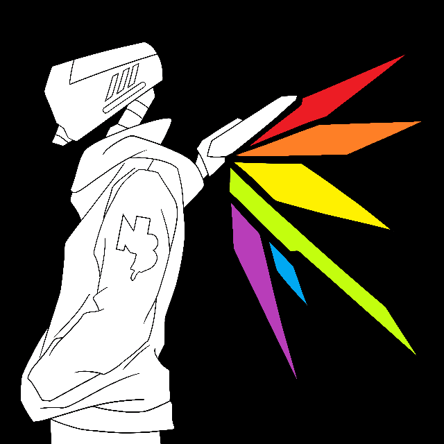

<h1>Hi 👋, I'm VexilonHacker ->|G_G|-></h1>
<h3>Red Team Cybersecurity Researcher | 17 y/o High School Student</h3>

---

<table>
<tr>
<td width="60%" valign="top">

### 🧠 About Me

- 🎓 High school student passionate about **cybersecurity** and ethical hacking  
- 🐧 Arch Linux user  
- 🛠️ Daily driver: **Neovim (NvChad)**  
- 🤖 Interested in **robotics** and hardware hacking  
- 📫 Reach me at: **[NeoCasperAsTheJaster@proton.me](mailto:NeoCasperAsTheJaster@proton.me)** or on Discord: 

</td>
<td width="40%" valign="top">

</td>
</tr>
</table>

---

## 💻 Tech Stack

**Languages & Scripting**

**Web & Servers**

**Databases**

**Data Science**

**Tools & Environment**

**Hardware Projects**
<a href="https://www.arduino.cc/" target="_blank" rel="noreferrer">
  
<a href="https://www.espressif.com/en/products/socs/esp32" target="_blank">
  

</a>

</a>

---
## 📊 GitHub & Quote

| GitHub Stats | Top Languages |
|:------------:|:-------------:|
|  |  |

| Developer Quote |
|:----------------:|
|  |

